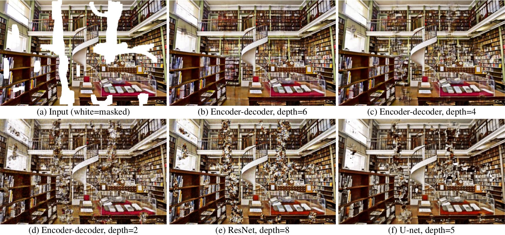
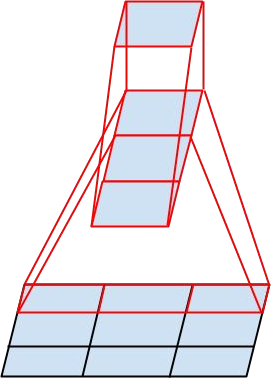
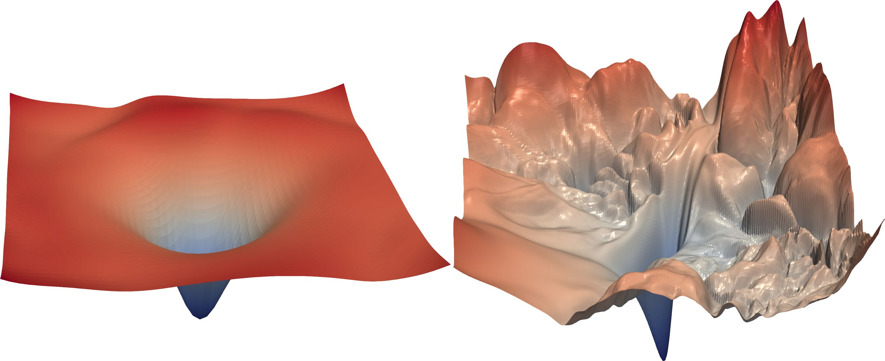

class: title
## NPFL114, Lecture 04

# Convolutional Networks


.author[
Milan Straka
]

---
class: middle
# Dropout Implementation

```python
def dropout(input, rate=0.5, training=False):
    def do_inference():
        return tf.identity(input)

    def do_train():
        random_noise = tf.random_uniform(tf.shape(input))
        mask = tf.cast(tf.less(random_noise, rate),
                       tf.float32)
        return x * mask / (1 - rate)

    if training == True:
        return do_train()
    if training == False:
        return do_inference()
    return tf.cond(training, do_train, do_inference)
```

---
class: middle
# Dropout Effect


---
class: middle
# Dropout Effect


---
# Convergence

The training process might or might not converge. Even if it does, it might
converge slowly or quickly.

There are _many_ factors influencing convergence and its speed, we now discuss
three of them.

---
class: middle, full
# Convergence – Saturating Non-linearities


---
# Convergence – Parameter Initialization

Neural networks usually need random initialization to _break symmetry_.

- Biases are usually initialized to a constant value, usually 0.

--

- Weights are usually initialized to small random values, either with uniform or
  normal distribution.
   - The scale matters for deep networks!

   - Originally, people used $U\left[-\frac{1}{\sqrt n}, \frac{1}{\sqrt n}\right]$ distribution.

--

   - Xavier Glorot and Yoshua Bengio, 2010:
     _Understanding the difficulty of training deep feedforward neural networks_.

     The authors theoretically and experimentally show that a suitable way to
     initialize a $ℝ^{n×m}$ matrix is $$U\left[-\sqrt{\frac{6}{m+n}}, \sqrt{\frac{6}{m+n}}\right].$$

---
class: middle, center
# Convergence – Parameter Initialization


---
class: middle, center
# Convergence – Parameter Initialization


---
class: middle
# Convergence – Gradient Clipping


---
# Convergence – Gradient Clipping


Using a given maximum norm, we may clip the gradient.
$$g ← \begin{cases}
  g & \textrm{ if }||g|| ≤ c \\\
  c \frac{g}{||g||} & \textrm{ if }||g|| > c
\end{cases}$$

The clipping can be per weight, per matrix or for the gradient as a whole.

---
class: middle, center
# Going Deeper

# Going Deeper

---
# Convolutional Networks

Consider data with some structure (temporal data, speech, images, …).

Unlike densely connected layers, we might want:
- Sparse (local) interactions
- Parameter sharing (equal response everywhere)
- Shift invariance

---
class: middle
# Convolutional Networks


---
# Convolution Operation

For a functions $x$ and $w$, _convolution_ $x \* w$ is defined as
$$(x \* w)(t) = ∫x(a)w(t - a)\d a.$$

For vectors, we have
$$(→x \* →w)\_t = ∑\_i x\_i w\_{t-i}.$$

Convolution operation can be generalized to two dimensions by
$$(⇉I \* ⇉K)\_{i, j} = ∑\_{m, n} ⇉I\_{m, n} ⇉K\_{i-m, j-n}.$$

Closely related is _cross-corellation_, where $K$ is flipped:
$$S\_{i, j} = ∑\_{m, n} ⇉I\_{i+m, j+n} ⇉K\_{m, n}.$$

---
class: center
# Convolution


---
# Convolution Operation

The $K$ is usually called a _kernel_ or a _filter_, and we generally apply
several of them at the same time.

Consider an input image with $C$ channels. The convolution operation with
$F$ filters of width $W$, height $H$ and stride $S$ produces an output with $F$ channels
kernels of total size $W × H × C × F$ and is computed as
$$(⇉I \* ⇉K)\_{i, j, k} = ∑\_{m, n, o} ⇉I\_{i\cdot S + m, j\cdot S + n, o} ⇉K\_{m, n, o, k}.$$

--

There are multiple padding schemes, most common are:
- `valid`: we only use valid pixels, which causes the result to me smaller
- `same`: we pad original image with zero pixels so that the result is exactly
  the size of the input

---
# Convolution Operation

There are two prevalent image formats:
- `NHWC` or `channels_last`: The dimensions of the 4-dimensional image tensor
  are batch, height, width, and channels.

  The original TensorFlow format, faster on CPU.

--

- `NCHW` or `channels_first`: The dimensions of the 4-dimensional image tensor
  are batch, channel, height, and width.

  Usual GPU format (used by CUDA and nearly all frameworks); on TensorFlow, not
  all CPU kernels are available with this layout.

---
# Pooling

Pooling is an operation similar to convolution, but we perform a fixed operation
instead of multiplying by a kernel.

- Max pooling: minor translation invariance
- Average pooling


---
# High-level CNN Architecture

We repeatedly use the following block:
1. Convolution operation
2. Non-linear activation (usually ReLU)
3. Pooling


---
class: middle
# AlexNet – 2012 (16.4% error)


---
# AlexNet – 2012 (16.4% error)

Training details:
- 2 GPUs for 5-6 days

- SGD with batch size 128, momentum 0.9, weight decay 0.0005

- initial learning rate 0.01, manually divided by 10 when validation error rate
  stopped improving

- dropout with rate 0.5 on fully-connected layers

- data augmentation using translations and horizontal reflections (choosing random
  $224 × 224$ patches from $256 × 256$ images)
  - during inference, 10 patches are used (four corner patches and a center
    patch, as well as their reflections)

---
class: middle, center
# AlexNet – ReLU vs tanh


---
class: middle
# LeNet – 1998


Achieved 0.8% test error on MNIST.

---
class: middle
# Similarities in V1 and CNNs


The primary visual cortex recognizes Gabor functions.

---
class: middle
# Similarities in V1 and CNNs


Similar functions are recognized in the first layer of a CNN.

---
class: middle, center
# CNNs as Regularizers – Deep Prior


---
class: middle
# CNNs as Regularizers – Deep Prior


---
class: middle
# CNNs as Regularizers – Deep Prior


---
class: middle
# CNNs as Regularizers – Deep Prior



[Deep Prior paper website with supplementary material](https://dmitryulyanov.github.io/deep_image_prior)

---
class: center
# VGG – 2014 (6.8% error)


---
class: middle
# Inception (GoogLeNet) – 2014 (6.7% error)


---
class: middle
# Inception (GoogLeNet) – 2014 (6.7% error)


---
class: middle
# Inception (GoogLeNet) – 2014 (6.7% error)


---
class: center
# Inception (GoogLeNet) – 2014 (6.7% error)


aux. classifiers, 0.3 weight

---
# Batch Normalization

_Internal covariate shift_ refers to the change in the distributions
of hidden node activations due to the updates of network parameters
during training.

Let $→x = (x\_1, \ldots, x\_d)$ be $d$-dimensional input. We would like to
normalize each dimension as $$\hat x\_i = \frac{x\_i - 𝔼[x\_i]}{\sqrt{\Var[x\_i]}}.$$
Furthermore, it may be advantageous to learn suitable scale $γ\_i$ and shift $β\_i$ to
produce normalized value $$y\_i = γ\_i\hat x\_i + β\_i.$$

---
# Batch Normalization

Consider a mini-batch of $m$ examples $(→x^{(1)}, \ldots, →x^{(m)})$.

_Batch normalizing transform_ of the mini-batch is the following transformation.

.algorithm[
**Inputs**: Mini-batch $(→x^{(1)}, \ldots, →x^{(m)})$, $ε ∈ ℝ$<br>
**Outputs**: Normalized batch $(→y^{(1)}, \ldots, →y^{(m)})$
- $→μ ← \frac{1}{m} ∑\_{i = 1}^m →x^{(i)}$
- $→σ^2 ← \frac{1}{m} ∑\_{i = 1}^m (→x^{(i)} - μ)^2$
- $\hat→x^{(i)} ← (→x^{(i)} - →μ) / \sqrt{σ^2 + ε}$
- $→y^{(i)} ← →γ \hat→x^{(i)} + →β$
]

--

Batch normalization is commonly added just before a nonlinearity. Therefore, we
replace $f(⇉W→x + →b)$ by $f(\textit{BN}(⇉W→x))$.

--

During inference, $→μ$ and $→σ^2$ are fixed. They are either precomputed
after training on the whole training data, or an exponential moving average is
updated during training.

---
class: middle
# Inception with BatchNorm (4.8% error)


---
class: middle, center
# Inception v2 and v3 – 2015 (3.6% error)




---
class: middle
# Inception v2 and v3 – 2015 (3.6% error)


---
class: middle, center
# Inception v2 and v3 – 2015 (3.6% error)


---
class: middle, center
# Inception v2 and v3 – 2015 (3.6% error)


---
class: middle
# ResNet – 2015 (3.6% error)


---
class: middle
# ResNet – 2015 (3.6% error)


---
class: middle
# ResNet – 2015 (3.6% error)


---
class: middle
# ResNet – 2015 (3.6% error)


---
class: middle
# ResNet – 2015 (3.6% error)


---
class: middle, full
# ResNet – 2015 (3.6% error)


